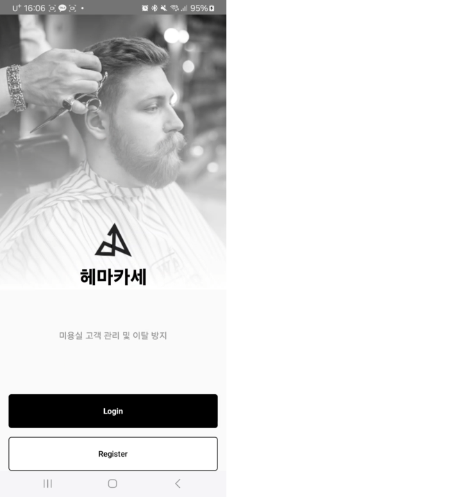
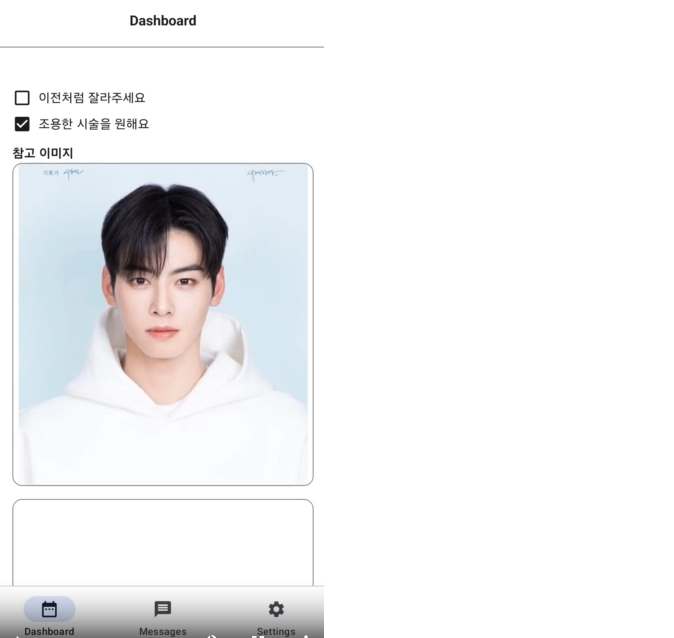
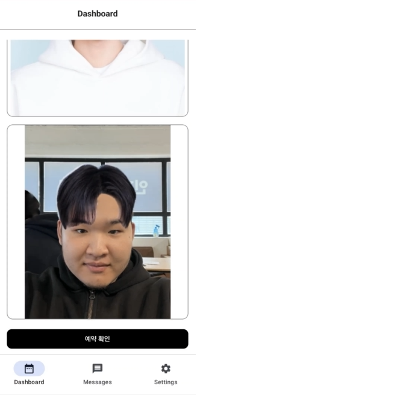

# 💇‍♀️ 헤마카세(Hemakase) – AI 기반 헤어스타일 분석 프로젝트

**헤마카세**는 미용실 이용자들을 위한 AI 기반 스타일 분석 및 커뮤니케이션 시스템입니다.  
딥러닝 기반 이미지 분석을 통해 사용자의 얼굴 이미지에서 헤어영역을 분리하고, 다양한 스타일을 시뮬레이션하거나 추천하는 기능을 목표로 합니다.

---

## 📌 주요 기능
- 얼굴 이미지 기반 헤어 영역 세분화
- 사용자 참고 이미지 기반 스타일 시뮬레이션
- 헤어스타일 추천 자동화
- 시술 전 상담 경험 개선

---

## 🛠 사용 기술

| 구분 | 기술 |
|------|------|
| Backend | Python |
| AI 모델 | PyTorch, DeepLab v3+, PSPNet |
| Task | 이미지 세그멘테이션 |
| 목적 | 미용실 고객 UX 개선 |

---

## 📁 프로젝트 구조

```
hemakase/
├── ai-model/
│   ├── hair_transfer.py
│   ├── requirements.txt
│   └── networks/
│       ├── deeplab_v3_plus.py
│       ├── mobile_hair.py
│       └── pspnet.py
├── assets/
│   └── images/
│       ├── dongchan.png
│       └── unu.png
├── presentation/
│   ├── 헤마카세 최종.pptx
│   └── 헤마카세 결과 보고서.pptx
├── video/
│   └── 헤마카세 시연영상.mp4
├── demo_screenshot_1.png
├── demo_screenshot_2.png
├── demo_screenshot_3.png
└── README.md
```

---

## 🚀 설치 및 실행 방법

```bash
# 1. 의존성 설치
pip install -r ai-model/requirements.txt

# 2. 실행
python ai-model/hair_transfer.py
```

---

## 🖥️ 데모 화면 예시

### 1. 로그인 화면


---

### 2. 스타일 선택 화면


---

### 3. 스타일 적용 결과


---

## 🎥 시연 영상 & 발표자료

📽 [헤마카세 시연영상](./video/헤마카세%20시연영상.mp4)  
📊 [헤마카세 최종 발표자료](./presentation/헤마카세%20최종.pptx)  
📄 [헤마카세 결과 보고서](./presentation/헤마카세%20결과%20보고서.pptx)
